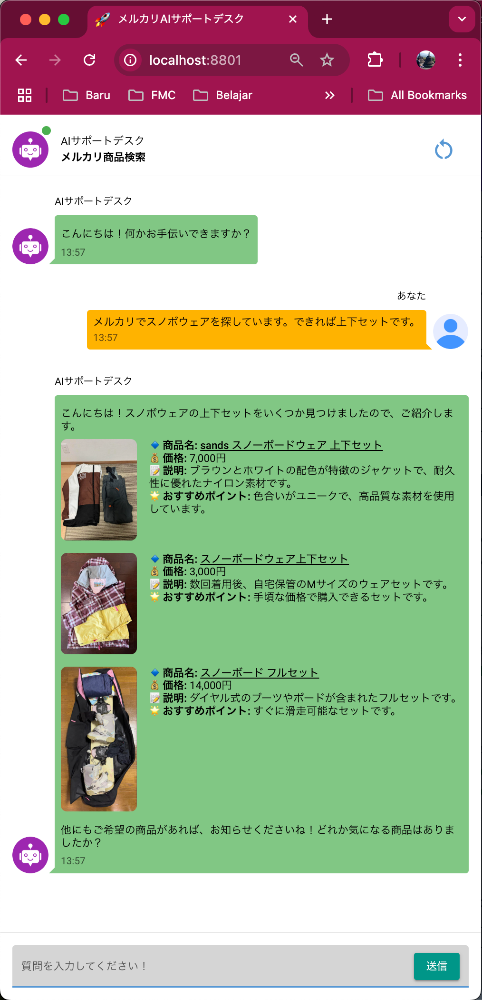

# Mercari Japan AI Shopper

<div style="display: flex;">
    
    <div>
        <p>Mercari Japan AI Shopper is a Python-based AI agent designed to assist users in finding the best products on Mercari Japan. The agent interprets natural language requests, performs searches on Mercari, retrieves product information, and provides recommendations in a user-friendly format.</p>
        <p>This project was a great learning experience, as I am more familiar with frameworks like LangChain, LangGraph, or LlamaIndex.</p>
    </div>
</div>

### Key Features:
1. **Understand User Requests**: The agent uses OpenAI's GPT-4 model to interpret natural language queries in Japanese. Currently, I am using the OpenAI API as I only have access to it.
2. **Effective Mercari Search**: Extracts keywords and sort order from user input to perform targeted searches on Mercari. To extract relevant keywords, I added restrictions and guides in the prompt (see `utils/prompt.py`).
3. **Data Retrieval**: Scrapes product details such as names, prices, descriptions, and images using Playwright. I chose Playwright because I am most familiar with it.
4. **Reasoned Recommendations**: Analyzes retrieved data and recommends the top 3 products with clear explanations. The recommendations are based on the conversation so far and tool-calling outputs.
5. **User-Friendly Output**: Presents recommendations in RAG Chat interface format, optimized for readability and mobile-friendliness.

---

## Setup Instructions

### Prerequisites
- **Docker**: Ensure Docker is installed on your system. You can download it from [Docker's official website](https://www.docker.com/).

### Steps to Build and Run the Application
1. **Extract the ZIP File**:
   Unzip this project folder. 

2. **Navigate to the Project Directory**:
   Open a terminal and navigate to the extracted project folder:
   You will see different output depend on your OS. For example:
   ```bash
   cd /path/to/extracted/project
   ```

3. **Add openai key**:
   As I am using openai API, the openai key is needed. Add your openai key in .env:
   ```bash
   OPENAI_API_KEY="your openai key is here"
   ```

3. **Build the Docker Image**:
   Build the Docker image using the provided Dockerfile:
   ```bash
   docker build -t mercari-ai-shopper .
   ```

4. **Run the Docker Container**:
   Run the container and map port 8801 to the host machine:
   ```bash
   docker run -p 8801:8801 mercari-ai-shopper
   ```

5. **Access the Applicationr**:
   Access the application on your localhost/browser on port 8801:
   ```bash
   http://localhost:8801
   ```
   If you're running Docker on a remote server, replace localhost with the server's IP address. Also, you can use Google Cloud Run continous integration as the docker file is also work in there. I also tested it and it works fine.

---

## Project Structure

```
.
├── .env                     # Environment variables, insert your OpenAI API key here
├── Dockerfile               # Docker configuration for containerized deployment
├── README.md                # Documentation for the project
├── requirements.txt         # Python dependencies
├── app/
│   ├── main_page.py         # Main application entry point
│   ├── state.py             # Manages OpenAI interactions conversation history and Agent!
│   ├── components/
│   │   ├── chat_input.py    # Handles user input in the chat interface
│   │   ├── chat_message.py  # Custom chat message component
│   │   ├── create_keywords.py # Extracts keywords and sort order from user input
│   │   ├── search_mercari.py # Scrapes product details from Mercari
│   ├── utils/
│   │   ├── custom_css.py    # Custom CSS for UI animations
│   │   ├── prompt.py        # Prompts for OpenAI interactions
│   ├── icon/                # Free static assets for UI.
```

---

## Design Choices

### Natural Language Understanding
- **Why GPT-4?**: OpenAI's GPT-4 model is used for its ability to accurately extract keywords and sort order from user input, ensuring precise searches. This model also capable to perform tools calling which in my opinion, check the requirement of this task.

### Web Scraping
- **Why Playwright?**: Playwright is used for robust and efficient web scraping. It handles dynamic content on Mercari's website and extracts product details such as names, prices, descriptions, and images. It uses correct and well-crafted keywords to serach for the items. Furthermore, it filters based on user preferences such as the price, likes, newest item, and so on.

### Tool Calling
- **How Tools Are Used**:
  - [`extract_keywords_and_sort_order`](app/components/create_keywords.py): Extracts keywords and determines the sort order based on user input. Here, user conversation input is process to extract meaningful keywords.
  - [`search_mercari`](app/components/search_mercari.py): Scrapes Mercari's website for product details using the extracted keywords and sort order. After the items are collected, it will then used for the recommendation pick-up process.

### User Interface
- **Why NiceGUI?**: NiceGUI provides a clean and interactive chat interface, allowing users to interact with the AI seamlessly. Furthermore, according to my experience, even for proof-of-concept project, it needs to look familiar and easy to understand thus I created this project using NiceGUI.

---

## How It Works

1. **User Input**: As I assume, the users are Japanese, the user enters a query in Japanese (e.g., "メルカリでスノボウェアを探しています。"). 
2. **Keyword Extraction**: The agent extracts keywords and determines the sort order using GPT-4.
3. **Mercari Search**: The agent performs a search on Mercari using the extracted keywords and retrieves product details.
4. **Recommendations**: The agent analyzes the retrieved data and recommends the top 3 products with reasons.
5. **Follow-Up Questions**: The agent can handle follow-up questions (e.g., "最初の商品についてもっと詳しく教えてください。") by referring to the conversation history.

---

## Potential Improvements

1. **Enhanced Recommendations**:
   - Include seller ratings and product conditions in the recommendations.
   - Use more tool call to analyzise and give feedback to the prompt, thus make the project self-learning.

2. **Advanced Filtering**:
   - Allow users to specify additional filters (e.g., price range, condition). As of now, the filter id set on the mercari page using Playwright. Might as well process data inside python.

3. **Performance Optimization**:
   - Cache search results to reduce redundant scraping using @functools.cache
   - Optimize Playwright scripts for faster data retrieval.

4. **Multilingual Support**:
   - Extend support for English and other languages.

4. **Add Comparison Tools**:
   - Extend the tools so that it can call amazon.co.jp to compare a brand new items to the second hand item in mercari. I have talked to some of my friend and they all agree that buying in mercari after consulting amazon for the price is good more! No one want to get scammed.
---

## Deliverables

This project includes:
1. **Source Code**: Python code implementing the AI agent.
2. **README.md**: This document, explaining the architecture, design choices, and usage.
3. **requirements.txt**: A list of required Python packages.
4. **Dockerfile**: For containerized deployment of the application.
5. **Demo video**: Showcasing the final product.
