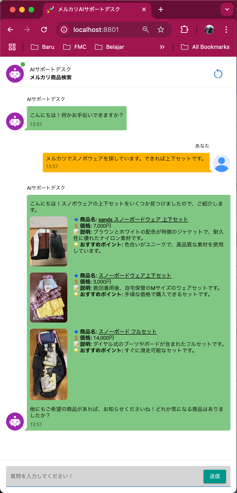

# Mercari Japan AI Agent Shopper

[Englishはこちら](README.md)

<div style="display: flex;">
    
    <div>
        <p>Mercari Japan AI Shopperは、メルカリで良い商品を見つけるのを手伝うAIです。日本語で質問すると、AIが商品を探して、おすすめを教えてくれます。</p>
        <p>このプロジェクトは、LangChainなどを使ったことがある私にとって、とても勉強になりました。</p>
    </div>
</div>

## 特徴 (Tokuchō - Key Features)

1.  **質問を理解**: OpenAIのGPT-4を使って、日本語の質問を理解します。今はOpenAIのAPIを使っています。
2.  **メルカリ検索**: 質問からキーワードを見つけて、メルカリで検索します。キーワードを見つけるために、プロンプトにルールを書いています (`utils/prompt.py`を見てください)。
3.  **データ取得**: Playwrightを使って、商品の名前、値段、説明、写真などを集めます。Playwrightをよく知っているので、これを選びました。
4.  **おすすめ**: 集めたデータから、おすすめの商品を3つ選び、理由を説明します。
5.  **見やすい表示**: おすすめをチャットのような画面で表示します。スマホでも見やすいようにしています。

---

## 準備 (Junbi - Setup Instructions)

### 必要なもの (Hitsuyō na mono - Prerequisites)

*   **Docker**: Dockerをインストールしてください。[Dockerのウェブサイト](https://www.docker.com/)からダウンロードできます。

### アプリの作り方と動かし方 (Apuri no tsukurikata to ugokashikata - Steps to Build and Run the Application)

1.  **ZIPファイルを解凍 (kaitō - Extract)**: このプロジェクトのZIPファイルを解凍してください。
2.  **プロジェクトのフォルダへ移動 (idō - Navigate)**: ターミナルを開いて、解凍したプロジェクトのフォルダへ移動してください。
    OSによって表示が変わります。例：

    ```bash
    cd /path/to/extracted/project
    ```
3.  **OpenAIキーを追加 (tsuika - Add)**: OpenAI APIを使うので、OpenAIキーが必要です。.envファイルにキーを書いてください。

    ```bash
    OPENAI_API_KEY="ここにあなたのOpenAIキー"
    ```
4.  **Dockerイメージを作成 (sakusei - Build)**: Dockerfileを使って、Dockerイメージを作ります。

    ```bash
    docker build -t mercari-ai-shopper .
    ```
5.  **Dockerコンテナを実行 (jikkō - Run)**: コンテナを動かして、ポート8801をあなたのパソコンにつなげてください。

    ```bash
    docker run -p 8801:8801 mercari-ai-shopper
    ```
6.  **アプリにアクセス (Access)**: ブラウザで `http://localhost:8801` にアクセスしてください。Dockerを別のサーバーで動かしている場合は、localhostをサーバーのIPアドレスに変えてください。Google Cloud Runでも動きます。テスト済みです。

---

## プロジェクトの構造 (Kōzō - Project Structure)

```
.
├── .env                     # OpenAI APIキーを書くファイル
├── Dockerfile               # Dockerの設定
├── README.md                # この説明書
├── requirements.txt         # 必要なPythonライブラリ
├── app/
│   ├── main_page.py         # アプリのメインファイル
│   ├── state.py             # OpenAIとのやり取りを管理
│   ├── components/
│   │   ├── chat_input.py    # チャットの入力
│   │   ├── chat_message.py  # チャットのメッセージ
│   │   ├── create_keywords.py # キーワードを見つける
│   │   ├── search_mercari.py # メルカリを検索
│   ├── utils/
│   │   ├── custom_css.py    # UIのCSS
│   │   ├── prompt.py        # OpenAIへの指示
│   ├── icon/                # UIのアイコン
```

---

## 設計の選択 (Sekkei no sentaku - Design Choices)

### 自然言語理解 (Shizen gengo rikai - Natural Language Understanding)

*   **なぜGPT-4?**: OpenAIのGPT-4は、日本語の質問からキーワードを見つけるのが得意だからです。

### ウェブスクレイピング (Web scraping)

*   **なぜPlaywright?**: Playwrightは、メルカリのウェブサイトから商品の情報を集めるのが得意だからです。

### ツール呼び出し (Tsūru yobidashi - Tool Calling)

*   **ツールの使い方 (Tsūru no tsukaikata - How Tools Are Used)**:
    *   [`extract_keywords_and_sort_order`](app/components/create_keywords.py): 質問からキーワードと並び順を見つけます。
    *   [`search_mercari`](app/components/search_mercari.py): キーワードを使ってメルカリを検索します。

### ユーザーインターフェース (Yūzā intāfēsu - User Interface)

*   **なぜNiceGUI?**: NiceGUIは、チャットのような画面を作るのが簡単だからです。

---

## 仕組み (Shikumi - How It Works)

1.  **ユーザー入力 (Yūzā nyūryoku - User Input)**: ユーザーが日本語で質問します (例: "メルカリでスノボウェアを探しています。")。
2.  **キーワード抽出 (Chūshutsu - Keyword Extraction)**: AIがキーワードを見つけます。
3.  **メルカリ検索 (kensaku - Mercari Search)**: AIがメルカリで商品を検索します。
4.  **おすすめ (Osusume - Recommendations)**: AIがおすすめの商品を選びます。
5.  **質問 (Shitsumon - Follow-Up Questions)**: AIは前の会話を覚えていて、質問に答えます。

---

## 改善点 (Kaizen-ten - Potential Improvements)

1.  **おすすめの改善 (Kaizen)**:
    *   売り手の評価や商品の状態を表示する。
    *   もっとツールを使って、AIが自分で学習するようにする。
2.  **フィルターの追加 (Tsuika)**:
    *   値段や状態などを指定できるようにする。
3.  **高速化 (Kōsoku-ka - Performance Optimization)**:
    *   検索結果を保存して、同じ検索をしないようにする。
    *   Playwrightをもっと速くする。
4.  **多言語対応 (Tagengo taiō - Multilingual Support)**:
    *   英語など、他の言語も使えるようにする。
5.  **比較ツール (Hikaku tsūru - Add Comparison Tools)**:
    *   Amazon.co.jpの商品と比較できるようにする。

---

## 成果物 (Seikabutsu - Deliverables)

このプロジェクトには、以下のものが含まれています。

1.  **ソースコード (Sōsu kōdo - Source Code)**: AIのプログラム
2.  **README.md**: この説明書
3.  **requirements.txt**: 必要なPythonライブラリのリスト
4.  **Dockerfile**: アプリを動かすための設定
5.  **デモビデオ (Demo bideo)**: アプリのビデオ
